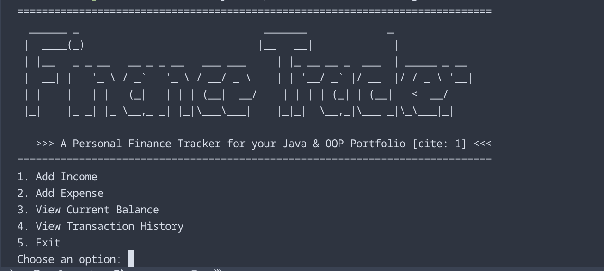
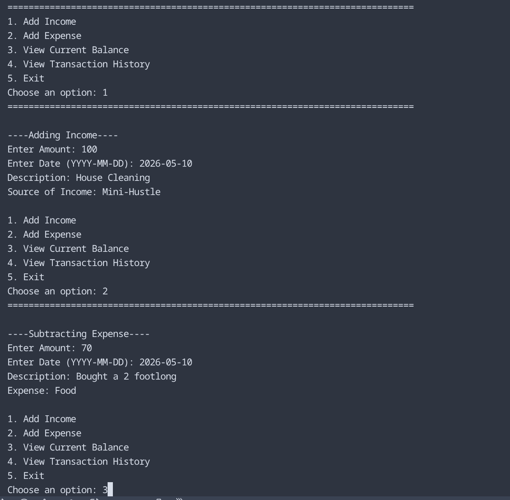
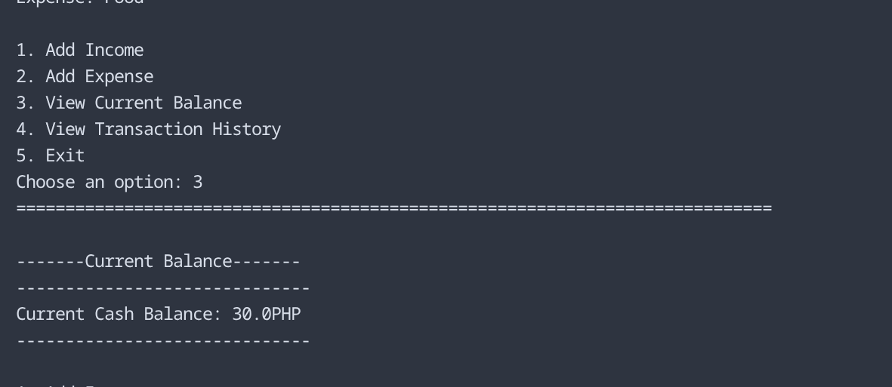
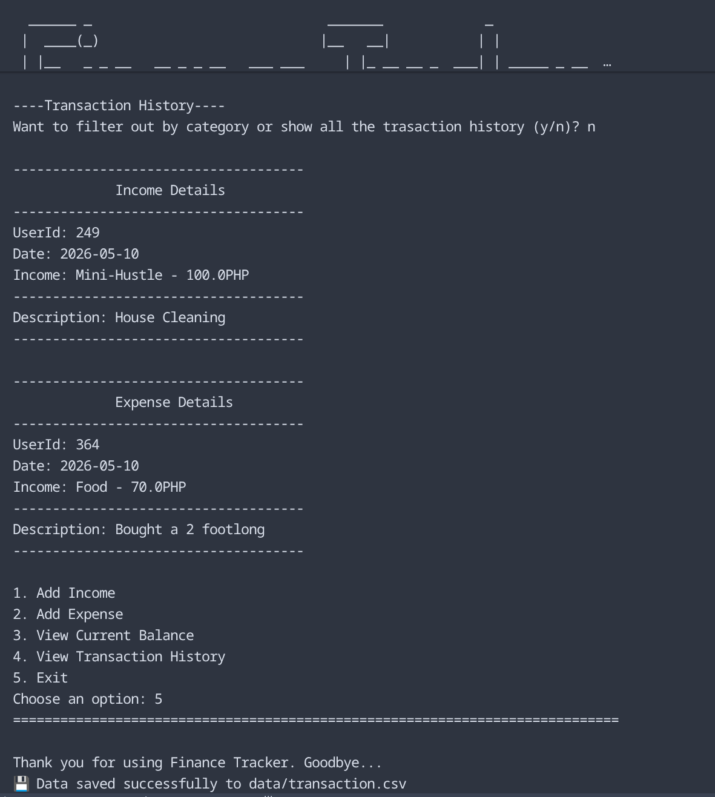

# Finance-Tracker CLI

=============================================================================
  ______ _                              _______             _             
 |  ____(_)                            |__   __|           | |            
 | |__   _ _ __   __ _ _ __   ___ ___     | |_ __ __ _  ___| | _____ _ __ 
 |  __| | | '_ \\ / _` | '_ \\ / __/ _ \\    | | '__/ _` |/ __| |/ / _ \\ '__|
 | |    | | | | | (_| | | | | (__|  __/    | | | | (_| | (__|   <  __/ |   
 |_|    |_|_| |_|\\__,_|_| |_|\\___\\___|    |_|_|  \\__,_|\\___|_|\\_\\___|_|   
                                                                           
   >>> A Personal Finance Tracker for your Java & OOP Portfolio <<<
=============================================================================

A robust, Object-Oriented command-line application built in Java to track personal income and expenses. This project demonstrates core software engineering principles, including data persistence and clean architecture.

## 🚀 Key Features

- **Transaction Management:** Add, view, and categorize Income and Expenses.
- **Data Persistence:** Automatically saves and loads data from a local `transaction.csv` file using Java I/O.
- **Financial Analytics:** Real-time calculation of total balance.
- **Advanced Filtering:** View transaction history or filter specific categories (e.g., Salary, Bills).
- **Resilient Input:** Comprehensive error handling for invalid user inputs.

---

## 🛠️ Tech Stack & Concepts

| Category | Technology / Concept |
| :--- | :--- |
| **Language** | Java 25+ |
| **Persistence** | Java I/O (BufferedReader/BufferedWriter) |
| **Data Format** | CSV (Comma-Separated Values) |
| **Version Control** | Git / GitHub |
| **OOP Pillars** | Abstraction, Inheritance, Encapsulation, Polymorphism |

---

## 🏗️ Architectural Overview

The project follows a **Separation of Concerns** model, dividing the application into logical packages:

```text
src/com/dev/finance/
├── logic/
│   ├── Main.java             # Entry point & CLI Menu Logic
│   └── FinanceManager.java   # Business logic & File I/O operations
└── models/
    ├── Transaction.java      # Abstract parent class
    ├── Income.java           # Specialized subclass for revenue
    └── Expense.java          # Specialized subclass for spending
```
---

## OOP Implementation Highlights

 **Abstraction:** The Transaction class is abstract, ensuring no generic transactions can be created without a type.

 **Polymorphism:** The FinanceManager stores all items in a single ArrayList<Transaction>, handling both Income and Expense objects dynamically.

 **Encapsulation:** Protected fields and private member variables ensure data integrity through controlled access.

--- 
## Installation

 **Prequisites**
 - Java Development Kit (JDK) 25 or higher.

 **1. Clone the Repository**
 ```git clone [https://github.com/bryankennethblando/Finance-Tracker.git](https://github.com/bryankennethblando/Finance-Tracker.git)
 cd Finance-Tracker
 ```

 **2. Compile the Project**
 ```javac -d bin src/com/dev/finance/models/*.java src/com/dev/finance/logic/*.java```

 **3. Run the Application**
 ```java -cp bin com.dev.finance.logic.Main```

## Sample Output

---

---

---

